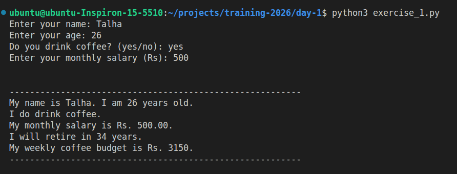
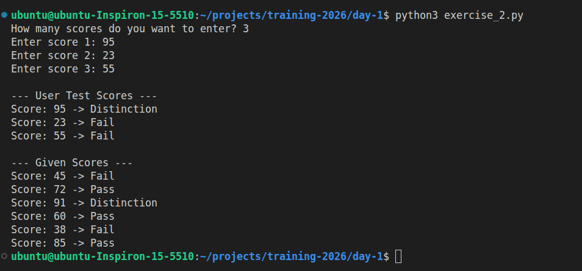
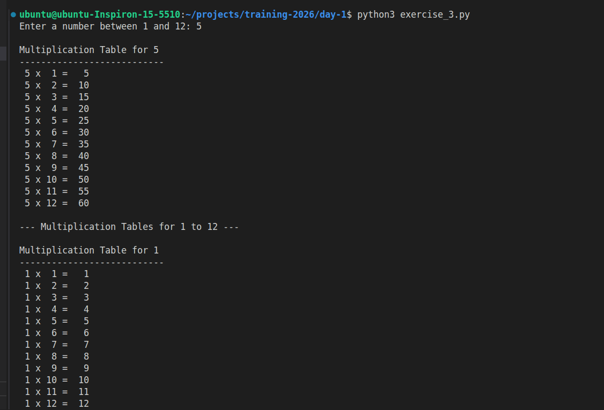

# Day 1: Python Basics Exercises

This repository contains three beginner Python exercises covering **variables, operators, functions, loops, input validation, and formatted output**. Each exercise is implemented in its own `.py` file, and example outputs are attached as images.

---

## Exercise 1 — `exercise_1.py` (Data types + operators)
- Prompts the user to enter: name, age, coffee habit, and monthly salary.  
- Computes:
  - Years until retirement (age 60)  
  - Weekly coffee budget (3 cups/day × Rs.150) if they drink coffee.  
- Prints a formatted summary using f-strings.  
- **Output:** 

---

## Exercise 2 — `exercise_2.py` (Control flow + functions)
- Function `grade_classifier(score)` returns:
  - `"Distinction"` → score ≥ 90  
  - `"Pass"` → 60 ≤ score < 90  
  - `"Fail"` → score < 60  
- Accepts **user-entered scores** and prints classifications.  
- Also prints classifications for the fixed list `[45, 72, 91, 60, 38, 85]`.  
- **Output:** 

---

## Exercise 3 — `exercise_3.py` (Loops + formatted tables)
- Prompts the user for a number (1–12) and prints its **multiplication table**, right-aligned.  
- Validates input using a `while` loop.  
- **Bonus:** Prints multiplication tables for all numbers 1–12.  
- **Output:** 

---

## Run

```bash
python3 exercise_1.py
python3 exercise_2.py
python3 exercise_3.py